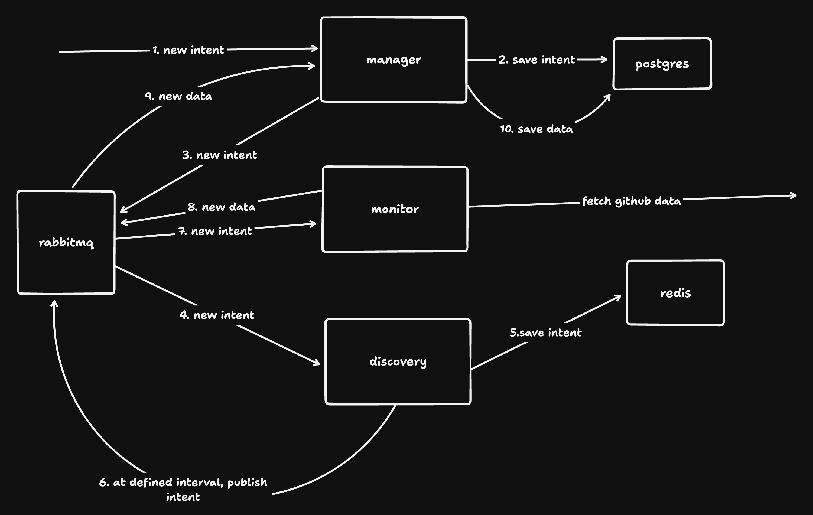

## Table of Contents

- [Table of Contents](#table-of-contents)
- [Introduction](#introduction)
- [Project Structure](#project-structure)
- [Components](#components)
- [Getting Started](#getting-started)
  - [Prerequisites](#prerequisites)
  - [Building](#building)
  - [Running](#running)
- [API Documentation](#api-documentation)
- [Development](#development)
- [Testing](#testing)
- [Deployment](#deployment)

## Introduction

This project is a distributed system consisting of three main components: Discovery, Manager, and Monitor. It provides a robust architecture for managing intents and commits, with a focus on scalability and maintainability.

## Project Structure

The project follows a standard Go project layout:

- `cmd/`: Contains the main applications for each component.
- `internal/`: Houses the internal packages and implementation details.
- `configs/`: Stores configuration files.
- `docs/`: Includes documentation, such as Swagger API specs.
- `build/`: Contains build-related files, including Dockerfiles.

## Components

1. **Discovery**: Responsible for managing scheduled jobs.
2. **Manager**: Handles the core business logic, including intent and commit management.
3. **Monitor**: Makes calls to github to fetch data and publish.

## Getting Started

### Prerequisites

- Go 1.22 or later
- Docker and Docker Compose
- Make

### Building

To build all components, run:

```sh
make build-all
```

This will compile the binaries for discovery, manager, and monitor in the `build/` directory.

To build individual components:

```sh
make build-discovery
make build-manager
make build-monitor
```

### Running

To run the entire system using Docker Compose:

```sh
docker-compose -f build/docker/docker-compose.yaml up
```

To run individual components:

1. Discovery:

   ```sh
   ./build/discovery
   ```

2. Manager:

   ```sh
   ./build/manager
   ```

3. Monitor:

   ```sh
   ./build/monitor
   ```

## API Documentation

The API is documented using Swagger. To view the API documentation:

1. Ensure the manager service is running.
2. Open a web browser and navigate to `http://localhost:8080/swagger/index.html`.

Alternatively, you can use the Swagger CLI tool:

```sh
swagger serve -F=swagger docs/swagger/swagger.yaml
```

This will start a local server with the Swagger UI, allowing you to explore and test the API endpoints interactively.

## Development

1. Clone the repository:

   ```sh
   git clone https://github.com/noelukwa/indexer.git
   ```

2. Install dependencies:

   ```sh
   go mod download
   ```

3. Make your changes and run tests:

    ```sh
    make test
    ```

4. Build and run the components as described in the [Building](#building) and [Running](#running) sections.

## Testing

Run all tests:

```sh
make test
```

## Deployment

The project includes Dockerfiles for each component in the `build/docker/` directory. To build Docker images:

```sh
docker build -t discovery -f build/docker/discovery/Dockerfile .
docker build -t manager -f build/docker/manager/Dockerfile .
docker build -t monitor -f build/docker/monitor/Dockerfile .
```

Deploy using Docker Compose:

```sh
docker-compose -f build/docker/docker-compose.yaml up -d
```
